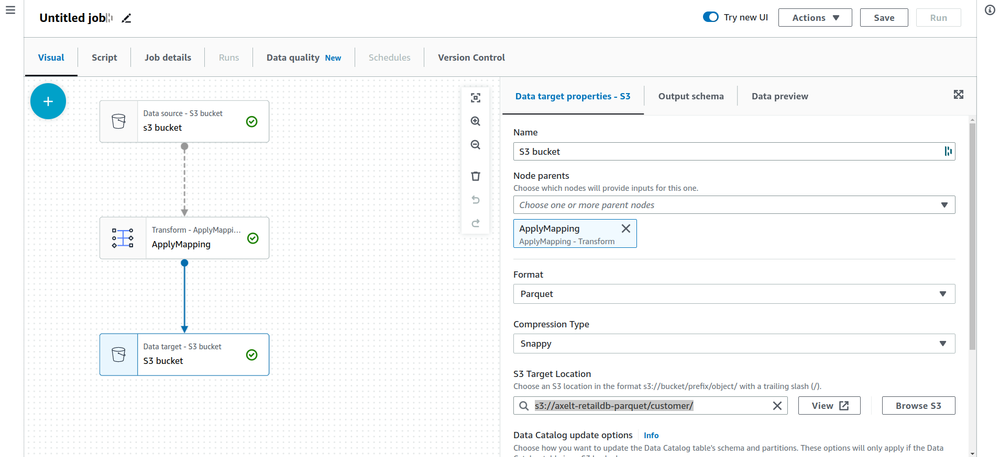

# Exercise 02

This lab will give you an understanding of the AWS Glue – a fully managed data catalog and ETL service.  

## What is ETL:  
In the world of data warehousing, if you need to bring data from multiple different data sources into one, centralized database, you must first:  

    * EXTRACT data from its original source  
    * TRANSFORM data by deduplicating it, combining it, and ensuring quality, to then  
    * LOAD data into the target database  
The ETL process is comprised of these 3 steps that enable data integration from source to destination: data Extraction, data Transformation, and data Loading.  

## what is aws Glue:  
AWS Glue is a serverless data integration service that makes it easy for analytics users to discover, prepare, move, and integrate data from multiple sources. You can use it for analytics, machine learning, and application development. It also includes additional productivity and data ops tooling for authoring, running jobs, and implementing business workflows. 

With AWS Glue, you can discover and connect to more than 70 diverse data sources and manage your data in a centralized data catalog. You can visually create, run, and monitor extract, transform, and load (ETL) pipelines to load data into your data lakes.  

## PreLab setup:

AWS s3 busket is used as a source of sales system retaildb. It stores transaction information about categories, customers, departements, order_items, orders and products.  
Before the Glue lab starts, check that the bucket is already created and that the data is in the bucket, otherwise, create the bucket and copy the source data to your S3 bucket.  
In today's lab, you will copy the data from a centralized S3 bucket to your AWS account,
crawl the dataset with AWS Glue crawler for metadata creation and transform the data
with AWS Glue to Query data and create a View with Athena and Build a dashboard with
Amazon QuickSight.  

## Copy Data across from staging Amazon S3 bucket to your S3 bucket

Issue the following commands in the terminal, and replace the bucket name with your own one.  

aws s3 cp --recursive s3://axelt-retail-db/categories/  s3://<YourBucketName>/categories/  
aws s3 cp --recursive s3://axelt-retail-db/customers/  s3://<YourBucketName>/customers/  
aws s3 cp --recursive s3://axelt-retail-db/departments/  s3://<YourBucketName>/departments/  
aws s3 cp --recursive s3://axelt-retail-db/order_items/  s3://<YourBucketName>/order_items/  
aws s3 cp --recursive s3://axelt-retail-db/orders/  s3://<YourBucketName>/orders/  
aws s3 cp --recursive s3://axelt-retail-db/products/  s3://<YourBucketName>/products/  

## Verify the Data:
  
1. Open the S3 console and view the data that was copied through terminal.  
2. Your S3 bucket name will look like below :  
BucketName/bucket_folder_name/objects  
3. Navigate to one of the files and review it using S3 Select:  
    a. Navigate in to the directory named categories and select the check box next to the file name categories.csv.  
    b. Click the Actions dropdown button and choose Query with S3 Select.  
    c. In the Query with S3 Select page, leave the default value for Input Settings and SQL Query and
click Run SQL query.  
    d. It will execute the specified SQL query and return the first 5 lines from the CSV file.  
Explore the objects in the S3 directory further.  

## PART A: Data Validation and ETL  
Create Glue Crawler for initial full load data  
1. Navigate to the AWS Glue service  
2. On the AWS Glue menu, select Crawlers.  
3. in Data catalog section, click dd crawlers.  
4. Click Create crawler.  
5. Enter retail-lab-crawler as the crawler name for initial data load.  
6. Optionally, enter the description. This should also be descriptive and easily recognized and Click
Next.  

  

7. Choose Data stores, click on add data source  
8. On the Add a data store page, make the following selections:  
    a. For Choose a data store, click the drop-down box and select S3.  
    b. For Crawl data in, select Specified path in my account.  
    c. For Include path, browse to the target folder stored CSV files, e.g., s3://retail-db  
9. click Next    

  

10. On the Choose an IAM role page, make the following selections:  
    a. Select Choose Create new IAM Role.  
    b. Enter new rIAM role name, e.g, AWSGlueServiceRole-Retaildb.  
    c. click on Create.  
    d. Click Next

  

11. On the Create a schedule for this crawler page, for Frequency, select Run on demand and Click Next.  

12. On the Configure the crawler’s output page, click Add database to create a new database for
our Glue Catalogue.   
13. Enter "retaildb" as your database name, entre "stg_" as table name prefix and click create.  

  

14. Review the summary page noting the Include path and Database output and Click Finish. The
crawler is now ready to run.  

15.  Select the crawler, click run crawler button  

  

Crawler will change status from starting to stopping, wait until crawler comes back to ready state (the
process will take a few minutes), you can see that it has created 6 tables.  

16. In the AWS Glue navigation pane, click Databases > Tables. You can also click the retaildb database to browse the tables.  

## Data Validation: 

1. Within the Tables section of your retaildb database, click the stg_customers table.  

   

You have noticed that tables have  column headers such as col0,col1,col2,col3. In absence of headers or when the crawler cannot determine the header type, default column headers are specified.  

  

This exercise uses the stg_customers table in an example of how to resolve this issue.  

2. Click Edit Schema on the top right side and change the column names.  

 

3. Repeat the preceding step to change the remaining tables.  

## Data ETL  

Pre-requisite: To store processed data in parquet format, we need a new bucket,  

1. Creata a new s3 bucket eg, reatail-db-parquet
2. In the left navigation pane, under ETL, click on "Data Integration and ETL" and click "AWS Glue Studio".
3. Choose “View Jobs”  
4. Leave the “Visual with a source and target” option selected, and press “Create”  

 

4. Select the “Data source - S3 bucket” at the top of the graph.  
5. In the panel on the right under “Data source properties - S3”, choose the reatildb database from the drop down.  
6. For Table, select the stg_customers table.  

 

7. Select the “ApplyMapping” node. In the Transform panel on the right and change the data type of "customer_id" column to int in the dropdown.  

 

8. Select the “Data target - S3 bucket” node at the bottom of the graph, and change the Format to "Parquet" in the dropdown Under Compression Type, select "Uncompressed" from the dropdown.  
9. Under “S3 Target Location”, select “Browse S3” browse to the “retaildb-parquet” bucket, and press “Choose”.  
10. In the textbox, append /customer/ to the S3 url. The path should look similar to "s3://axelt-retaildb-parquet/customer/". The job will automatically create the folder.  

 

11.  Finally, select the Job details tab at the top. Enter Glue-retaildb-customers under Name.  
12.  For “IAM Role”, select the role named similar to AWSGlueServiceRole-RetailDB.  
13.  set Requested number of workers to 3
14.  Press the “Save” button in the top right-hand corner to create the job.  
15.  Once you see the “Successfully created job” message in the banner, click the “Run” button to
start the job.  
16. Select “Jobs” from the navigation panel on the left-hand side to see a list of your jobs.  
17. Select “Monitoring” from the navigation panel on the left-hand side to view your running jobs, success/failure rates and various other statistics.   

  

18. We need to repeat this process for an additional 5 jobs, to transform the categories, departments, order_items and orders, products tables.  
19. Under the “Actions” dropdown, select “Clone job”.