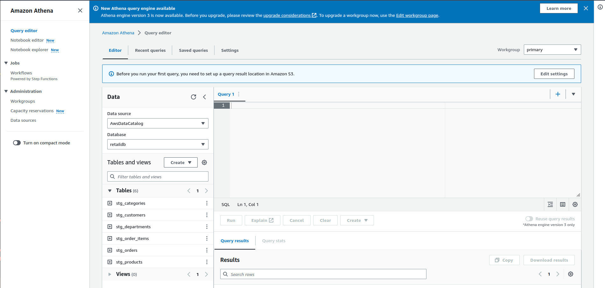

# Exercise 04

This lab will give you an understanding of the AWS Athena – a fully managed interactive sql query service.  

## What is Athena:  
Amazon Athena is a service that enables data analysts to perform interactive SQL queries in the web-based cloud storage service, Amazon Simple Storage Service (S3). Athena is used with large-scale data sets.  
Amazon Athena enables users to analyze data in Amazon S3 using Structured Query Language (SQL). The tool is designed for quick, ad hoc and complex analysis.  

Because Athena is a serverless query service, analysts do not need to manage any underlying compute infrastructure to use it.  

1. Open the S3 console and search for Athena service.  
If it’s the first time you are using Athena in your AWS Account, click Get Started  

In the pop-up window in the Query result location field, enter your s3 bucket location followed by /,
so that it looks like s3://axelt-athenalog/datalab/ and click Save.

  

To select some rows from the table, try running:  

select * from stg_categories;  

To get a row count, run:  

select count(*) from stg_categories;  

In past exercise, we created table using Glue Crawler using, now we will explore an alternate using Athena Query editor.

Create Athena Tables Using Query Editor:  

When you run a CREATE TABLE query in Athena, you register your table with the AWS Glue Data
Catalog. Let’s start creating tables.  

1. We will create our first table by running following statement that point to parquet files. In
create statement LOCATION clause, you’ll notice that we are using parquet files.   

CREATE EXTERNAL TABLE `stg_customers`(  
  `customer_id` bigint ,   
  `customer_fname` string ,   
  `customer_lname` string ,   
  `customer_email` string ,   
  `customer_password` string ,   
  `customer_street` string ,   
  `customer_city` string ,   
  `customer_state` string ,   
  `customer_zipcode` bigint )  
STORED AS PARQUET  
LOCATION 's3://axelt-retaildb-parquet/customer';  

2. Repeat the preceding step to create categories, departments, order_items and orders, products tables

Congratulations!! You have successfully completed this lab.   
