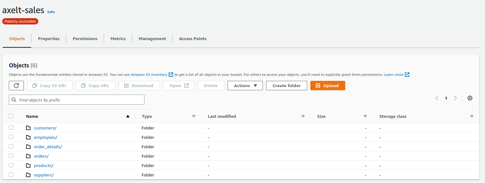

# Exercise 05:  

## Copy Data across from staging Amazon S3 bucket to your S3 bucket
In today's lab, you will copy the data from a centralized S3 bucket to your AWS account.  
To list the datasets , run the following command in the terminal.  

aws s3 ls s3://axelt-sales/csv/ 

You will see the list of datasets :  

            PRE customers/  
            PRE employees/  
            PRE order_details/  
            PRE orders/  
            PRE products/  
            PRE suppliers/  

Create an S3 bucket in your aws account where you can copy this datasets:  

aws s3 mb s3://"YourBUcketName"  

Issue the following command in the terminal, and replace the bucket name with your own one.  

aws s3 cp --recursive s3://axelt-sales/csv/customers/ s3://"YouBucketName"/csv/customers/  --copy-props none

Repeat this step to copy the other datasets.   

## Verify the Data  

1. Open the S3 console and view the data that was copied through terminal.
2. Your S3 bucket name will look like below : BucketName/csv/bucket_folder_name/objects.csv  

   

3. Navigate to one of the files and review it using S3 Select:  
    a. Navigate in to the directory named categories and select the check box next to the file name customers.csv.  
    b. Click the Actions dropdown button and choose Query with S3 Select.  
    c. In the Query with S3 Select page, leave the default value for Input Settings and SQL Query and
click Run SQL query.  
    d. It will execute the specified SQL query and return the first 5 lines from the CSV file.  
Explore the objects in the S3 directory further.  

## PART A: Data Validation and ETL  
Create Glue Crawler for initial full load data  
1. Navigate to the AWS Glue service  
2. On the AWS Glue menu, select Crawlers.  
3. in Data catalog section, click dd crawlers.  
4. Click Create crawler.  
5. Enter retail-lab-crawler as the crawler name for initial data load.  
6. Optionally, enter the description. This should also be descriptive and easily recognized and Click
Next.  
7. Choose Data stores, click on add data source  
8. On the Add a data store page, make the following selections:  
    a. For Choose a data store, click the drop-down box and select S3.  
    b. For Crawl data in, select Specified path in my account.  
    c. For Include path, browse to the target folder stored CSV files, e.g., s3://"YourBucketName"/csv/  
9. click Next    
10. On the Choose an IAM role page, make the following selections:  
    a. Select Choose Create new IAM Role.  
    b. Enter new IAM role name, e.g, AWSGlueServiceRole-salesdb.  
    c. click on Create.  
    d. Click Next

11. On the Create a schedule for this crawler page, for Frequency, select Run on demand and Click Next.  

12. On the Configure the crawler’s output page, click Add database to create a new database for
our Glue Catalogue.   
13. Enter "salesdb" as your database name, entre "stg_" as table name prefix and click create.
14. Review the summary page noting the Include path and Database output and Click Finish. The
crawler is now ready to run.  

15.  Select the crawler, click run crawler button.  

Crawler will change status from starting to stopping, wait until crawler comes back to ready state (the
process will take a few minutes), you can see that it has created 6 tables.  

16. In the AWS Glue navigation pane, click Databases > Tables. You can also click the salesdb database to browse the tables.  

## Data Validation: 

1. Within the Tables section of your salesdb database, click the stg_customers table.  
You have noticed that tables have columns header, this means that the csv files contain headers.  
Repeat the preceding step to check the other tables.  

## Data ETL  

Pre-requisite: To store processed data in parquet format, we need a new bucket,  

1. Creata a new s3 folder in your bucket eg, parquet
2. In the left navigation pane, under ETL, click on "Data Integration and ETL" and click "AWS Glue Studio".
3. Choose “View Jobs”  
4. Leave the “Visual with a source and target” option selected, and press “Create”  
5. Select the “Data source - S3 bucket” at the top of the graph.  
5. In the panel on the right under “Data source properties - S3”, choose the salesdb database from the drop down.  
6. For Table, select the stg_customers table. 
7. Select the “ApplyMapping” node. In the Transform panel on the right and change the data type of "customer_id" column to int in the dropdown.  
8. Select the “Data target - S3 bucket” node at the bottom of the graph, and change the Format to "Parquet" in the dropdown Under Compression Type, select "Uncompressed" from the dropdown.  
9. Under “S3 Target Location”, select “Browse S3” browse to the 'yourBucketname”/parquet/ bucket, and press “Choose”.  
10. In the textbox, append /customer/ to the S3 url. The path should look similar to "s3://axelt-sales/parquet/customer/". The job will automatically create the folder.
11. Finally, select the Job details tab at the top. Enter Glue-salesdb-customers under Name.  
12. For “IAM Role”, select the role named similar to AWSGlueServiceRole-salesdb.  
13. set Requested number of workers to s3
14. Press the “Save” button in the top right-hand corner to create the job.  
15. Once you see the “Successfully created job” message in the banner, click the “Run” button to
start the job.  
16. Select “Jobs” from the navigation panel on the left-hand side to see a list of your jobs.  
17. Select “Monitoring” from the navigation panel on the left-hand side to view your running jobs, success/failure rates and various other statistics.   
18. We need to repeat this process for an additional 5 jobs, to transform the employees, suppliers, order_details, orders and products tables.  
19. Under the “Actions” dropdown, select “Clone job”.

## Lambda Loader
deploy python application with AWS lambda to automate the loading of the files from AWS s3 to AWS RDS.

## Create IAM Role
You start with creation of the IAM role which AWS Lambda function uses for the authorization to call other AWS Services.

1. Login to the AWS Console. Select Ireland as the region.
2. Goto the IAM Management console and click on the Roles menu in the left and then click on the Create role button.
3. On the next screen, select Lambda as the service and click on the Next: Permissions button.
4. On the next screen, select "AWSLambdaBasicExecutionRole", "AmazonRDSFullAccess" and AmazonS3FullAccess as the policy and click on the Next: Tags button.
5. On the next screen, click on the Next: Review button.
6. On the next screen, type in "lambda_s3_rds" for the Role name and click on the Create role button.
7. The role is created in no time. The next step is to create the lambda function.  

## Create Lambda loader
You create the Lambda Function to laod csv files from s3 to rds.

1. In the Lambda Console, click on the Functions menu in the left and then click on the Create function button
2. On the next screen, select Author from scratch as the option. Type in "lambda_loader" as the name. 
   Select Python 3.8 as the runtime. Select Use an existing role as the option for the execution role and select aws_lambda_rds for the role.
   Finally, click on the Create function button.
3. The function is created in no time. You will configure Lambda function using code provided with this workshop. Download the project code https://github.com/atifrani/aws-data-exercices from github repository.
4. Import the zip code into your lambda fucntion by clicking on the "Upload from" button and then click on the .zip file option.
5. Add lambda layer,  go to Layers section, click on "add a layer" buttom, select "Specify an ARN". finally add this two layers   
   "arn:aws:lambda:eu-west-1:898466741470:layer:psycopg2-py38:1"  
   "arn:aws:lambda:eu-west-1:580247275435:layer:LambdaInsightsExtension:33"  
6. Check lambda configurations.
7. The Lambda function is ready. Let’s now configure the database storage.

# Create Postgresql Table.

You create a postgresql tables.

1. From AWS Athena,select salesdb database.  
2. To generate SQL DDL run this command SHOW CREATE TABLE `stg_customers`;  
3. Repeat this command to generate the SQL DDL dir the other tables.  
4. Connect to your postgresql database using BDEAVER.
5. Open a new sql editor and execute the sql queries to create tables.
6. Check if the table exist by runing this quesry "select * from tables"
7. Go to the lambda code and update ther database informations.  

## Test in the console.  
Invoke the Lambda function manually using sample Amazon S3 event data.  
To test the Lambda function using the console:    
1. For your function, in the Code tab, under Code source, choose the arrow next to Test, and then choose Configure test event from the dropdown list. 
2. In the Configure test event window, do the following:  
   * Choose Create new test event.  
   * For Event name, enter a name for the test event. For example, "mys3testevent".  
   * For Event sharing settings, choose Private.  
   * For Template, choose S3 Put (s3-put).  
   * In the Event JSON, replace the following values:  
        us-east-1 – The AWS Region where you created the Amazon S3 bucket and the Lambda function "eu-west-1".  
        example-bucket – The Amazon S3 bucket that you created earlier "YourBucketName".  
        test%2Fkey – The name of the sample object that you uploaded to the bucket (for example, csv/customers.csv).  
   * Choose Save.  
3. To invoke the function with your test event, under Code source, choose Test.  
The Execution results tab displays the response, function logs, and request ID.  

## Add trigger.  
Using an Amazon S3 trigger to invoke a Lambda function.  

1. In the Functions page of the Lambda console, choose the function lambda_loader that you created earlier.  
2. Choose Add trigger.  
3. Choose S3 as the source.  
4. For Bucket, choose the bucket you created earlier. Keep the other default settings.  
5. Acknowledge the Recursive invocation warning.  
6. Choose Add.  

## Test the S3 trigger
Invoke your function when you upload a file to the Amazon S3 source bucket. 

To test the Lambda function using the S3 trigger  
   * On the Buckets page of the Amazon S3 console, choose the name of the source bucket that you created earlier.  
   * Remove the existing files  
   * Run the following command to upload the files.  
aws s3 cp --recursive s3://axelt-sales/csv/customers/ s3://"YouBucketName"/csv/customers/    

   * Open the Functions page of the Lambda console.  
   * Choose the name of your function (lambda_loader).  
   * To verify that the function ran once for each file that you uploaded, choose the Monitor tab. This page shows graphs for the metrics that Lambda sends to CloudWatch. The count in the Invocations graph should match the number of files that you uploaded to the Amazon S3 bucket.  
   * To view the logs in the CloudWatch console, choose View logs in CloudWatch. Choose a log stream to view the logs output for one of the function invocations. 

